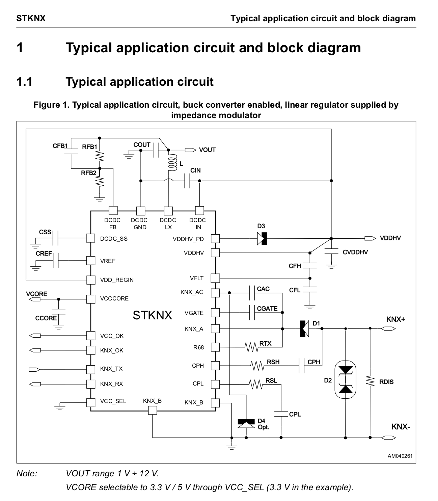
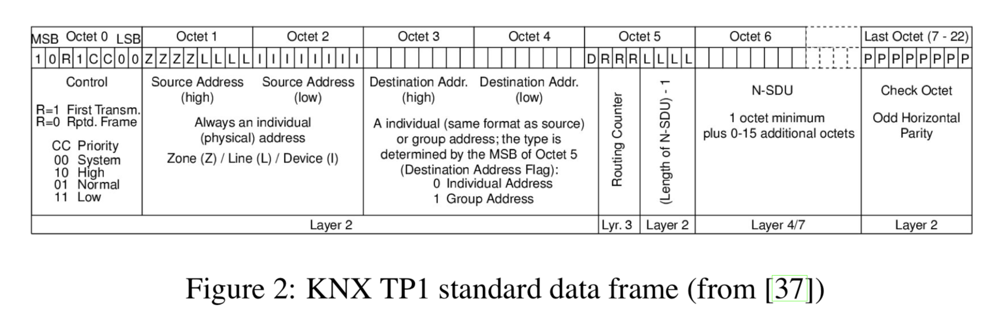
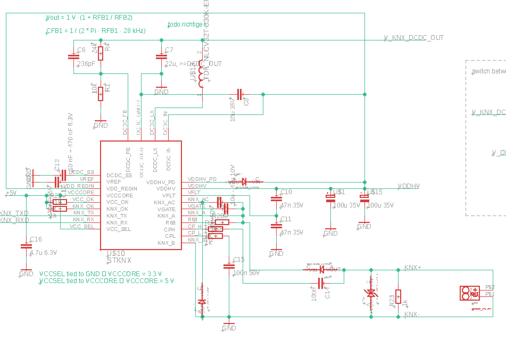
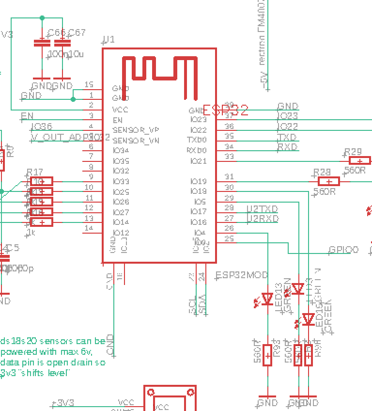
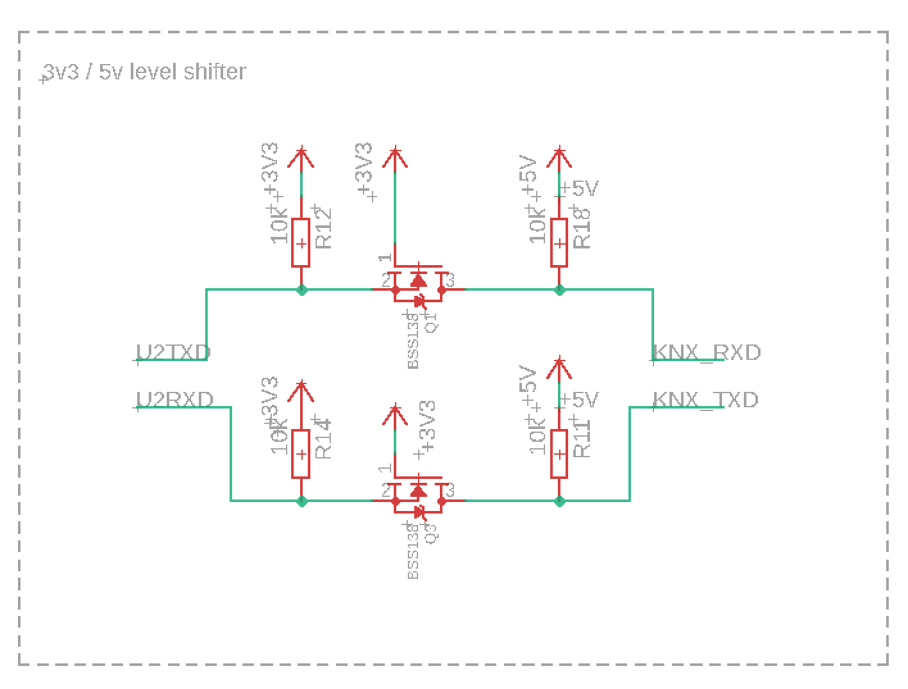

# ESP32 EIB KNX STKNX Receive Demo

This code demonstrates how to read bytes from  [STKNX](https://www.st.com/en/interfaces-and-transceivers/stknx.html).
STKNX tranceives all bytes read from KNX bus to its KNX_RX pin and has neither built-in buffers nor talks a standard UART as it's competetor [TP-UART](http://www.opternus.com/de/siemens/knx-chipset/knx-transceiver-ics-tp-uart-fze1066.html) does.

## Features

  - Retreive startbit by GPIO interrupt (cpu-friendly)
  - Read bits by hardware timer (cpu-friendly)
  - minimal ISR (cpu-friendly). For reading databits only one shift and one OR-operations are performed.

## Typical STKNX application circuit


## KNX TP1 frame


## KNX signal coding


## Schematic PDF
[Schematic PDF](images/esp32_knx_onewire.pdf "Schematic PDF")

## Schematic STKNX


## Schematic ESP32


## Schematic Levelshifter


### Tech

This project requires espressif standard ESP-IDF framework. No external Libs needed but requires

### Dependencies
* [ESP-IDF](https://github.com/espressif/esp-idf)

### Compile
```sh
$ make
```

### Flash
```sh
$ make flash
```

### Run
```sh
$ make flash monitor
```

### Demo
```sh
I (0) cpu_start: Starting scheduler on APP CPU.
I (265) gpio: GPIO[4]| InputEn: 0| OutputEn: 1| OpenDrain: 0| Pullup: 0| Pulldown: 0| Intr:0 
I (265) gpio: GPIO[17]| InputEn: 1| OutputEn: 0| OpenDrain: 0| Pullup: 1| Pulldown: 0| Intr:1 
waiting...
waiting...
0XBD 0X22 0X87 0X78 0XD4 0X1 0XE3  0 0X7 0X7C 0X6 0X60 0XF7 0XF6 0XCC 0XFF waiting...
waiting...
0XBC 0X11 0X17 0X78 0X50 0X1 0XE3  0 0X7 0X7C 0XA6 0XCD 0XC5 0XFF 0X9C 0X17 0XB8 0XC0 0XA0 0X17 0X78 0XFC  0 0X7 0X7C 0XA6 0XCD 0XE5 0X9C 0X17 0XB8 0XC0 0XA0 0X17 0X78 0XFC  0 0X7 0X7C 0XA6 0XCD 0XE5 0X9C 0X17 0XB8 0XC0 0XA0 0X17 0X78 0XFC  0 0X7 0X7C 0XA6 0XCD 0XE5 waiting...
waiting...
waiting...
waiting...
waiting...
waiting...
0XBC 0X11 0X17 0X78 0X50 0X1 0XE3  0 0X7 0X7C 0XA6 0XCD 0XC5 0XFF 0X9C 0X17 0XB8 0XC0 0XA0 0X17 0X78 0XFC  0 0X7 0X7C 0XA6 0XCD 0XE5 0X9C 0X17 0XB8 0XC0 0XA0 0X17 0X78 0XFC  0 0X7 0X7C 0XA6 0XCD 0XE5 0X9C 0X17 0XB8 0XC0 0XA0 0X17 0X78 0XFC  0 0X7 0X7C 0XA6 0XCD 0XE5 0XBC 0X11 0X17 0X78 0X50 0X2 0XE3  0 0X7 0X7C 0X6 0X4C 0XD2 0XFF 0X9C 0X17 0XB8 0XC0 0XA0 0X27 0X78 0XFC  0 0X7 0X7C 0X6 0X4C 0XF2 0X9C 0X17 0XB8 0XC0 0XA0 0X27 0X78 0XFC  0 0X7 0X7C 0X6 0X4C 0XF2 0X9C 0X17 0XB8 0XC0 0XA0 0X27 0X78 0XFC  0 0X7 0X7C 0X6 0X4C 0XF2 0XBC 0X11 0X17 0X78 0X50 0X3 0X37 0X7F  0 0X80 0X99 0XD7 0X7E 0XFC 0X9C 0X17 0XB8 0XC0 0XA0 0X37 0X70 0XFC  0 0X7 0X7C 0XA6 0XCD 0XE7 0XFF 0X9C 0X17 0XB8 0XC0 0XA0 0X37 0X70 0XFC  0 0X7 0X7C 0XA6 0XCD 0XE7 0XFF 0X9C 0X17 0XB8 0XC0 0XA0 0X37 0X70 0XFC  0 0X7 0X7C 0XA6 0XCD 0XE7 0XFF 0XBC 0X11 0X17 0X78 0X50 0X4 0XE3  0 0X7 0X7C 0X6 0X75 0XED 0XFF 0XCC 0XFF 0XBC 0X11 0X17 0X78 0X50 0X5 0X37 0X7F  0 0X80 0X99 0XD7 0X7E 0XF0 0X9C 0X17 0XB8 0XC0 0XA0 0X57 0X70 0XFC  0 0X7 0X7C 0XA6 0XCD 0XE1 0XFF 0X9C 0X17 0XB8 0XC0 0XA0 0X57 0X70 0XFC  0 0X7 0X7C 0XA6 0XCD 0XE1 0XFF 0X9C 0X17 0XB8 0XC0 0XA0 0X57 0X70 0XFC  0 0X7 0X7C 0XA6 0XCD 0XE1 0XFF waiting...
0XBC 0X22 0X87 0X78 0XD4  0 0X37 0X7F  0 0X80 0XC 0X57 0X73 0XF9 0XCC 0XFF waiting...
waiting...
waiting...

```

### Credits
Special Thanks to [Philipp Aigner](https://www.aignerelektronik.at)

License
----
MIT
