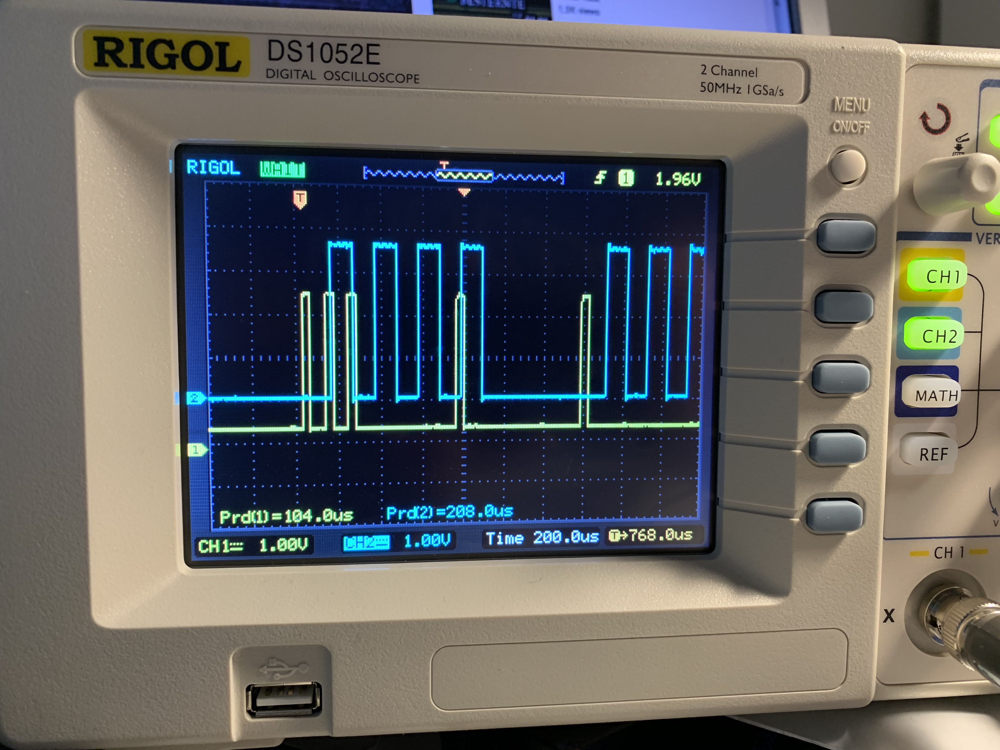
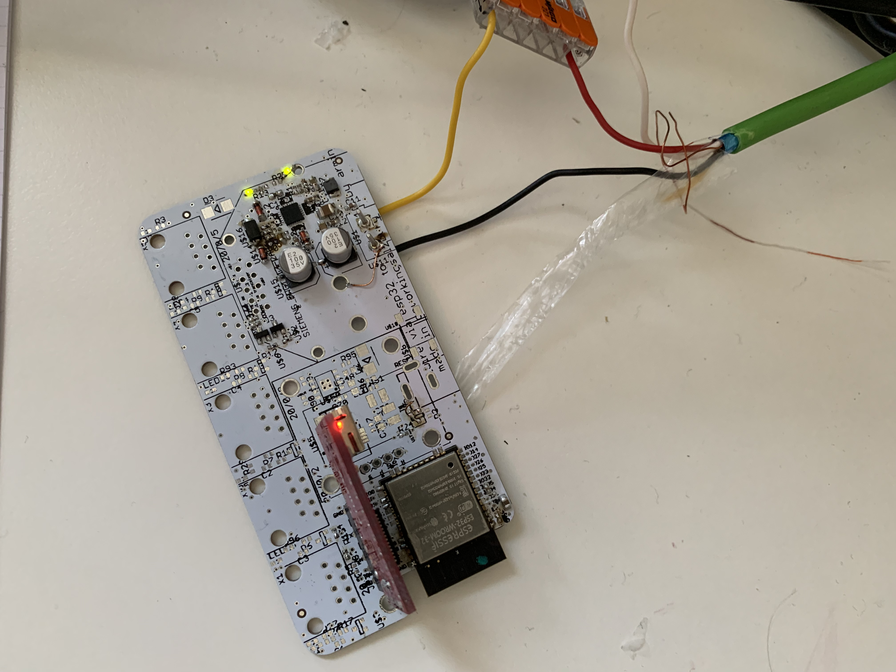

# Open KNX Lib

## Receive Demo
This code demonstrates how to read bytes from  [STKNX](https://www.st.com/en/interfaces-and-transceivers/stknx.html).

## STKNX vs TP-UART
STKNX tranceives all bytes read from KNX bus to its KNX_RX pin and has neither built-in buffers nor talks a standard UART as it's competetor [TP-UART](http://www.opternus.com/de/siemens/knx-chipset/knx-transceiver-ics-tp-uart-fze1066.html) does.

## Features
  - Retreive startbit by GPIO interrupt (cpu-friendly)
  - Read bits by hardware timer (cpu-friendly)
  - minimal ISR for bitbanging knx bits (cpu-friendly).

## Typical STKNX application circuit


## KNX TP1 frame

[reference](https://www.auto.tuwien.ac.at/downloads/knxcalibur/diplomarbeit_fpraus_printed.pdf)


## KNX TP1 control frame


Here you can see a octet read by stknx: CH1 is data from STKNX, CH2 is generated by software in ISR to demonstrate when bits are read (here: 8 bits, 11bits should be read to read start-, parity- and stopbit as well)

This demo-octed is read as: 11100001000 where
- 1: startbit: OK, this should be 1
- 1: D0 (LSB) (inverted)
- 1: D1 (inverted)
- 0: D2 (inverted)
- 0: D3 (inverted)
- 0: D4 (inverted)
- 0: D5 (inverted)
- 1: D6 (inverted)
- 0: D7 (MSB) (inverted)
- 0: (inverted: 1) even paritybit OK ("ones" in databits(D0-D7): 1+1+1 = 3 -> odd-> 1)
- 0: stopbit: OK, this should be 0

So this octet is read as: 01000011 -> inverted 10111100 -> 0xBC

## KNX signal coding


## Schematic PDF
[Schematic PDF](images/esp32_knx_onewire.pdf "Schematic PDF")

## STKNX / ESP32 board


## Schematic STKNX


## Schematic ESP32


## Schematic Levelshifter


### Requirements
Espressif ESP-IDF framework. No external Libs needed.

* [ESP-IDF](https://github.com/espressif/esp-idf)

### Compile
```sh
$ make
```

### Flash
```sh
$ make flash
```

### Run
```sh
$ make flash monitor
```

### Demo
```sh
I (0) cpu_start: Starting scheduler on APP CPU.
I (315) gpio: GPIO[4]| InputEn: 0| OutputEn: 1| OpenDrain: 0| Pullup: 0| Pulldown: 0| Intr:0 
I (325) gpio: GPIO[5]| InputEn: 0| OutputEn: 1| OpenDrain: 0| Pullup: 0| Pulldown: 0| Intr:0 
I (335) gpio: GPIO[18]| InputEn: 0| OutputEn: 1| OpenDrain: 0| Pullup: 0| Pulldown: 0| Intr:0 
I (345) gpio: GPIO[19]| InputEn: 0| OutputEn: 1| OpenDrain: 0| Pullup: 0| Pulldown: 0| Intr:0 
I (355) gpio: GPIO[21]| InputEn: 0| OutputEn: 1| OpenDrain: 0| Pullup: 0| Pulldown: 0| Intr:0 
I (365) gpio: GPIO[22]| InputEn: 0| OutputEn: 1| OpenDrain: 0| Pullup: 0| Pulldown: 0| Intr:0 
I (375) gpio: GPIO[23]| InputEn: 0| OutputEn: 1| OpenDrain: 0| Pullup: 0| Pulldown: 0| Intr:0 
I (1355) gpio: GPIO[17]| InputEn: 1| OutputEn: 0| OpenDrain: 0| Pullup: 1| Pulldown: 1| Intr:1 
waiting for KNX frames ...
KNX TP1 FRAME: [R:1 Prio:3 1/2/3	5/9/1 routing:6 len:1 chk:0xCC]
KNX TP1 FRAME: [R:1 Prio:3 15/15/254	5/8/1 routing:6 len:1 chk:0xCC]
KNX TP1 FRAME: [R:1 Prio:3 1/2/3	5/9/1 routing:6 len:1 chk:0x60]
KNX TP1 FRAME: [R:1 Prio:3 15/15/254	5/8/1 routing:6 len:1 chk:0x60]
KNX TP1 FRAME: [R:1 Prio:3 1/2/3	5/9/1 routing:6 len:1 chk:0x00]
KNX TP1 FRAME: [R:1 Prio:3 15/15/254	5/8/1 routing:6 len:1 chk:0xCC]
KNX TP1 FRAME: [R:1 Prio:3 1/2/3	5/9/1 routing:6 len:1 chk:0x00]
KNX TP1 FRAME: [R:1 Prio:3 15/15/254	5/8/1 routing:6 len:1 chk:0x00]
KNX TP1 FRAME: [R:1 Prio:3 1/2/3	5/9/1 routing:6 len:1 chk:0xCC]
KNX TP1 FRAME: [R:1 Prio:3 15/15/254	5/8/1 routing:6 len:1 chk:0xCC]
KNX TP1 FRAME: [R:1 Prio:3 1/2/3	5/9/1 routing:6 len:1 chk:0x00]
KNX TP1 FRAME: [R:1 Prio:3 15/15/254	5/8/1 routing:6 len:1 chk:0xCC]
KNX TP1 FRAME: [R:1 Prio:3 1/2/3	5/9/1 routing:6 len:1 chk:0xCC]
KNX TP1 FRAME: [R:1 Prio:3 15/15/254	5/8/1 routing:6 len:1 chk:0x00]
[...]
```

### Credits
Special Thanks to [Philipp Aigner](https://www.aignerelektronik.at) and Franz Augernigg

License
----
MIT
